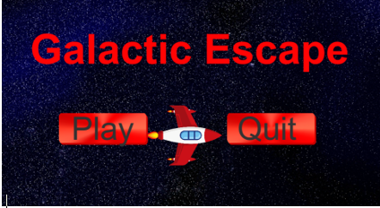
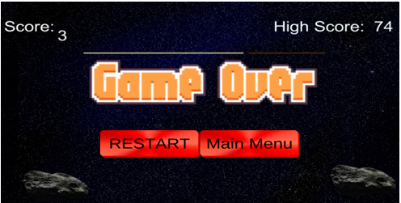

# 🚀 Space Runner - 2D Unity Game

**Space Runner** is a fast-paced 2D space-themed game developed in Unity.  
You control a rocket ship, dodge incoming meteors, and try to survive as long as possible to increase your score!

## 🎮 Gameplay Features

- 🛰️ **Player Control:** Move your rocket ship using **arrow keys**
- ☄️ **Obstacles:** Randomly spawning meteoroids that you must dodge
- 🧠 **Scoring System:** The longer you survive, the higher your score
- ⏸️ **Pause Menu:** Pause and resume the game anytime
- 🏁 **Main Menu:** Navigate through the game using UI buttons
- 🔁 **Restart Option:** Instantly restart after a crash
- ✨ **Simple UI:** Clean layout using Unity’s **TextMesh Pro**

## 🕹️ Controls

| Action        | Key              |
|---------------|------------------|
| Move Up       | ↑ Arrow Key      |
| Move Down     | ↓ Arrow Key      |
| Move Left     | ← Arrow Key      |
| Move Right    | → Arrow Key      |
| Pause / Resume| P                |
| Restart       | R (in gameplay)  |
| Navigate UI   | Mouse Click      |

## 🛠️ Built With

- **Unity** (2022 or later)
- **C#**
- **TextMesh Pro**
- 2D GameKit Elements

## 📸 Screenshots

### Main menu

### Main Game

### Restart

## 📂 Project Structure

Assets/

├── Scenes/

├── Scripts/

├── Sprites/

├── Prefabs/

├── TextMesh Pro/

ProjectSettings/

Packages/

## 📌 How to Run

1. Open project in Unity Hub

2. Open the scene: Assets/Scenes/MainMenu.unity

3. Click ▶️ Play to start

4. First You need to properly Setup the Unity
## 🙌 Contributions

Pull requests and suggestions are welcome!
Feel free to fork this repo or open an issue to discuss improvements.
## License 📜
This project is open source and available under the [MIT](https://choosealicense.com/licenses/mit/)

